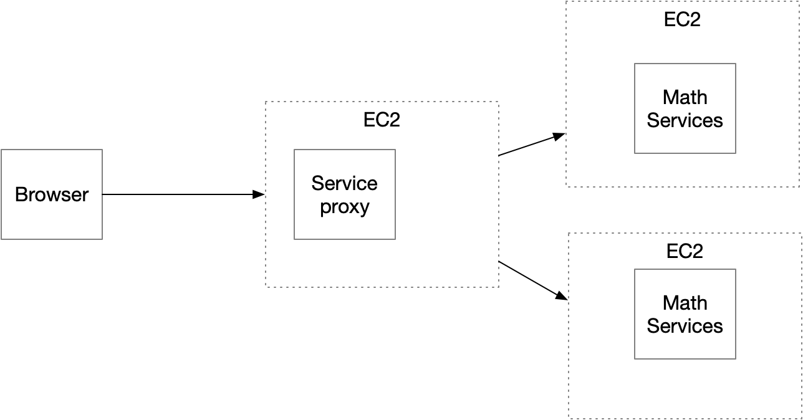

# Parcial Segundo Corte - AREP (Arquitecturas Empresariales)

## Problema
 
- Diseñar, construir y desplegar una aplicación web para investigar el problema matemático asignado. 
- El programa debe estar desplegado en AWS. 
- Las tecnologías usadas en la solución deben ser Maven, Git, GitHub, Spring, HTML5 y js.
- No usar librerías adicionales.

## Contexto
- Diseñar un prototipo de sistema de microservicios que tenga un servicio como el de la figura para computar las funciones numéricas.
- El servicio de las funciones numéricas debe estar desplegado en al menos dos instancias virtuales de EC2.
- Implementar un service proxy que reciba las solicitudes de llamado desde los clientes  y se las delegue a las dos instancias del servicio numérico usando un algoritmo de round-robin. 
- El proxy deberá estar desplegado en otra máquina EC2. 
- Configurar las direcciones y puertos de las instancias del servicio en el proxy usando variables de entorno del sistema operativo.  
- Construir un cliente Web mínimo con un formulario que reciba el valor y de manera asíncrona invoke el servicio en el PROXY. 
- Hacer un formulario para cada una de las funciones.
- El cliente debe ser escrito en HTML y JS.

## Detalles adicionales de la arquitectura y del API

- Construir una aplicación web para investigar este problema.
- Cliente asíncrono que corra en el browser escrito en HTML5 y JS (No usar librerías, solo html JS básico). 
- El cliente NO COMPUTA LA SECUENCIA DIRECTAMENTE, sino que la delega a un servicio REST corriendo en AWS.
- El servicio REST puede ser GET o POST.
- Se debe construir la aplicación usando Spring Boot y desplegarla en un contenedor corriendo en AWS.
- Usar los mejores estándares de diseño, arquitectura y programación.

## Problema asignado

### Funciones de ordenamiento: dos funciones.

- Uno recibe una lista de cadenas y un valor a buscar e implementa la búsqueda lineal :  linearSearch(lista, valor) retorna un json con el índice de la primera aparición del valor o con -1 si no encuentra el valor.
- Uno recibe una lista ordenada de cadenas y un valor a buscar e implementa la búsqueda binaria de manera recursiva : binarySearch(n), retorna un json con el índice de la primera aparición del valor o con -1 si no encuentra el valor.
 
### Búsqueda Lineal (Búsqueda Secuencial)

Método simple y directo para encontrar un elemento en un conjunto de datos. Funciona de la siguiente manera:

- Inicio: Comenzar desde el primer elemento del conjunto de datos.
- Comparación: Comparar cada elemento con el valor buscado.
- Resultado:
Si el elemento actual es igual al valor buscado, se retorna la posición de ese elemento, indicando así que el elemento ha sido encontrado.
Si el elemento actual no es igual al valor buscado, se pasa al siguiente elemento.
- Finalización: Este proceso continúa hasta que se encuentra el elemento o se ha recorrido todo el conjunto de datos.
- No encontrado: Si se llega al final del conjunto sin encontrar el valor, se indica que el elemento no está presente.

La búsqueda lineal no requiere que los datos estén ordenados y es efectiva para conjuntos de datos pequeños, pero su eficiencia disminuye a medida que el tamaño del conjunto de datos aumenta, ya que en el peor caso, se deben comparar todos los elementos.

### Búsqueda Binaria

Método más eficiente que la búsqueda lineal, pero requiere que el conjunto de datos esté ordenado previamente. Su proceso se describe de la siguiente manera:

- Inicio: Determinar los índices de inicio y fin del conjunto de datos, que inicialmente son el primer y último elemento, respectivamente.
- División: Calcular el índice medio del conjunto de datos actual y comparar el elemento en esta posición con el valor buscado.
- Comparación:
Si el elemento medio es igual al valor buscado, se retorna la posición de este elemento, indicando que se ha encontrado.
Si el elemento medio es mayor que el valor buscado, se descarta la mitad superior del conjunto y se repite el proceso con la mitad inferior.
Si el elemento medio es menor que el valor buscado, se descarta la mitad inferior del conjunto y se repite el proceso con la mitad superior.
- Iteración: El proceso se repite, reduciendo a la mitad el tamaño del conjunto de datos en cada paso.
- Finalización: Este proceso continúa hasta que se encuentra el valor o el subconjunto se reduce a cero.

La búsqueda binaria es muy eficiente en conjuntos de datos grandes, ya que reduce significativamente el número de comparaciones necesarias en comparación con la búsqueda lineal, logrando una complejidad temporal de O(log n), donde n es el número de elementos en el conjunto de datos.

### Detalles técnicos de la arquitectura y del API

- Implemente los servicios para responder al método de solicitud HTTP GET. Deben usar el nombre de la función especificado. Los parámetros deben ser pasados en variables de query con nombres "list" y "value".
- El proxy debe delegar el llamado a los servicios de backend. El proxy y los servicios se deben implementar en Java usando Spring.

### Ejemplo 1 de un llamado 

https://amazonxxx.x.xxx.x.xxx:{port}/linearsearch?list=10,20,13,40,60&value=13
 
Salida. El formato de la salida y la respuesta debe ser un JSON con el siguiente formato

{
 "operation": "linearSearch",
 "inputlist": "10,20,13,40,60",
 "value": "13"
 "output":  "2"
}

### Ejemplo 2 de un llamado

https://amazonxxx.x.xxx.x.xxx:{port}/linearsearch?list=10,20,13,40,60&value=99
 
Salida. El formato de la salida y la respuesta debe ser un JSON con el siguiente formato
 
{
 "operation": "linearSearch",
 "inputlist": "10,20,13,40,60",
 "value": "99"
 "output":  "-1"
}
 
### Ejemplo 3 de un llamado

https://amazonxxx.x.xxx.x.xxx:{port}/binarysearch?list=10,20,13,40,60&value=13
 
Salida. El formato de la salida y la respuesta debe ser un JSON con el siguiente formato
 
{
 "operation": "binarySearch",
 "inputlist": "10,20,13,40,60",
 "value": "13"
 "output":  "2"
}

## Referencias

- https://docs.oracle.com/javase/8/docs/api/
- https://spring.io/guides/gs/rest-service
- https://docs.aws.amazon.com/corretto/latest/corretto-17-ug/amazon-linux-install.html
- AWS Academy
- AWS